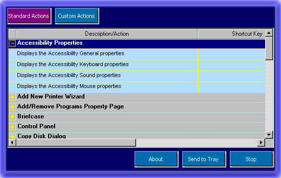



## Hotkey Manager Beta Version

### Description

Manages and implements hotkey in Windows 95/98/2000
 
### More Info
 

             |
---                |---
**Submitted On**   |2000-06-05 10:34:36
**By**             |[VBCrazy](https://github.com/Planet-Source-Code/PSCIndex/blob/master/ByAuthor/vbcrazy.md)
**Level**          |Advanced
**User Rating**    |5.0 (10 globes from 2 users)
**Compatibility**  |VB 5\.0, VB 6\.0
**Category**       |[Complete Applications](https://github.com/Planet-Source-Code/PSCIndex/blob/master/ByCategory/complete-applications__1-27.md)
**World**          |[Visual Basic](https://github.com/Planet-Source-Code/PSCIndex/blob/master/ByWorld/visual-basic.md)
**Archive File**   |[CODE\_UPLOAD6434642000\.zip](https://github.com/Planet-Source-Code/vbcrazy-hotkey-manager-beta-version__1-8634/archive/master.zip)

